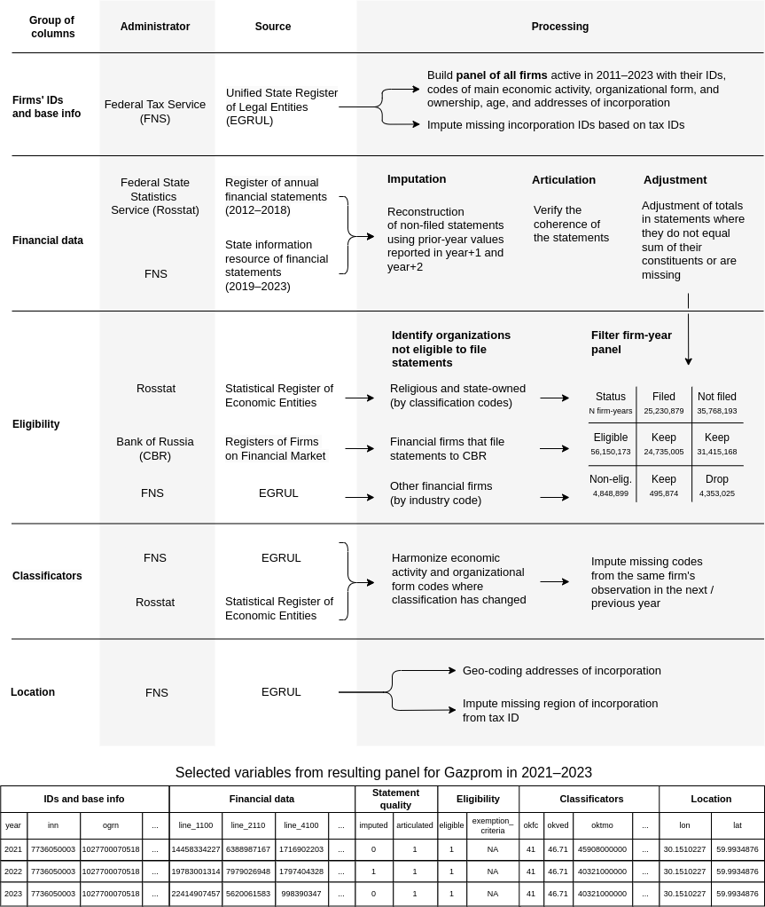
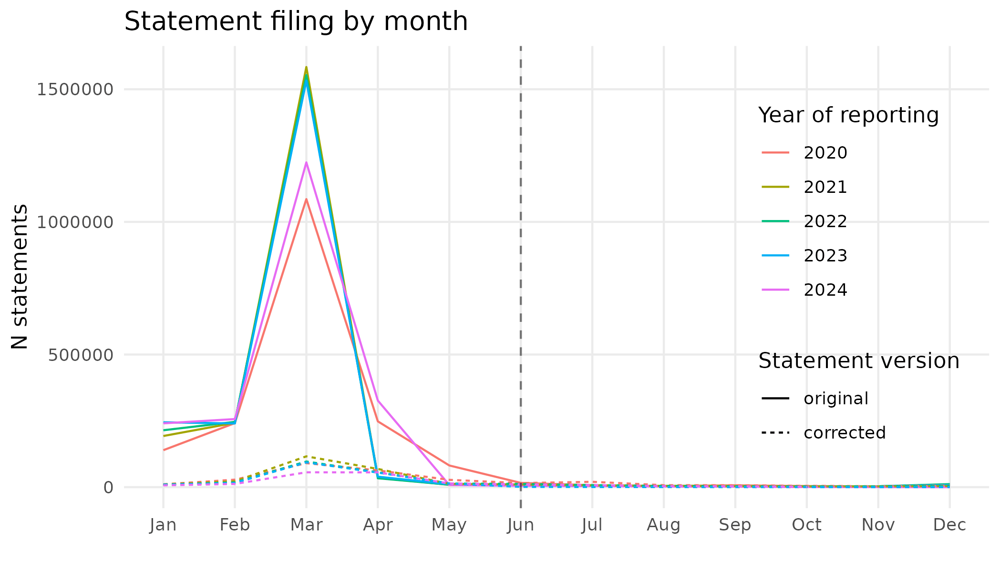
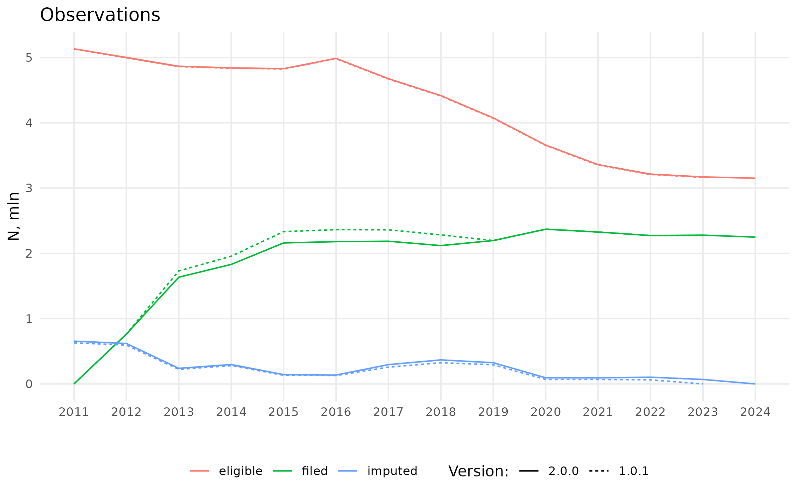
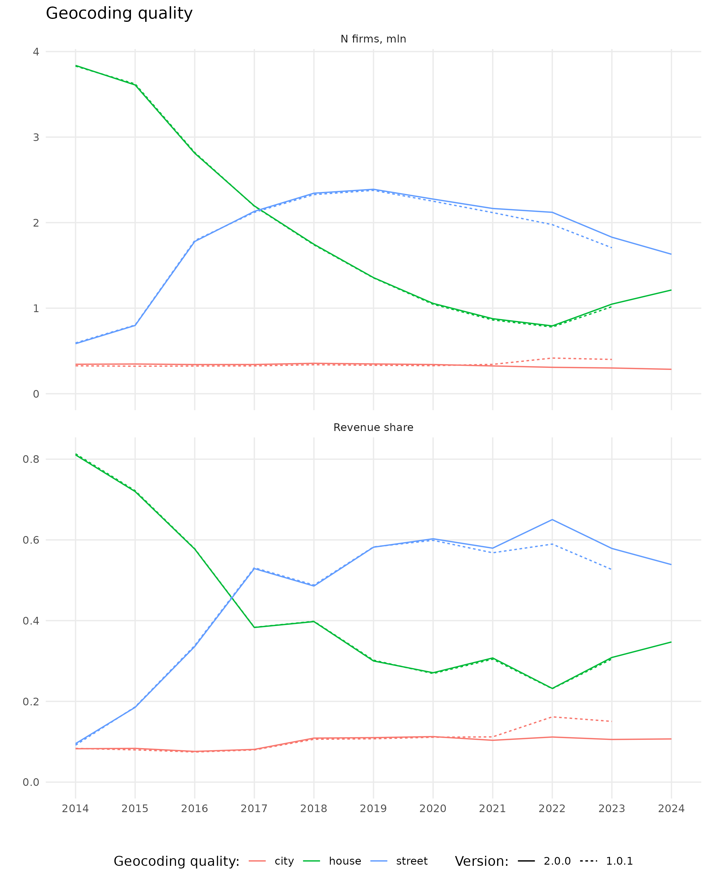

# The Russian Financial Statements Database (RFSD)
[](https://huggingface.co/datasets/irlspbru/RFSD) &nbsp;&nbsp;&nbsp; [](https://doi.org/10.5281/zenodo.14622208) &nbsp;&nbsp;&nbsp; [](https://www.nature.com/articles/s41597-025-05150-1) &nbsp;&nbsp;&nbsp; [](https://arxiv.org/abs/2501.05841) &nbsp;&nbsp;&nbsp; [](https://creativecommons.org/licenses/by/4.0/) &nbsp;&nbsp;&nbsp;  &nbsp;&nbsp;&nbsp;  

The Russian Financial Statements Database (RFSD) is an open, harmonized collection of annual unconsolidated financial statements of the universe of Russian firms:

- 🔓 First open data set with information on every active firm in Russia.

- 🗂️ First open financial statements data set that includes non-filing firms.

- 🏛️ Sourced from two official data providers: the [Rosstat](https://rosstat.gov.ru/opendata/7708234640-7708234640bdboo2018) and the [Federal Tax Service](https://bo.nalog.ru).

- 📅 Covers 2011-2024, will be continuously updated.

- 🏗️ Restores as much data as possible through non-invasive data imputation, statement articulation, and harmonization.

The RFSD is hosted on 🤗 [Hugging Face](https://huggingface.co/datasets/irlspbru/RFSD) and [Zenodo](https://doi.org/10.5281/zenodo.14622208) and is stored in a structured, column-oriented, compressed binary format Apache Parquet with yearly partitioning scheme, enabling end-users to query only variables of interest at scale.

The accompanying paper provides internal and external validation of the data: [https://doi.org/10.1038/s41597-025-05150-1](https://doi.org/10.1038/s41597-025-05150-1).

Here we present the code used to create the dataset, as well as the instructions for importing the data in R or Python environment and use cases.

## Importing The Data

You have two options to ingest the data: download the `.parquet` files manually from Hugging Face or Zenodo or rely on 🤗 [Hugging Face Datasets](https://huggingface.co/docs/datasets/en/index) library.


### Python

#### 🤗 Hugging Face Datasets
It is as easy as:

``` Python
from datasets import load_dataset
import polars as pl

# This line will download 6.6GB+ of all RFSD data and store it in a 🤗 cache folder
RFSD = load_dataset('irlspbru/RFSD')

# Alternatively, this will download ~540MB with all financial statements for 2023
# to a Polars DataFrame (requires about 8GB of RAM)
RFSD_2023 = pl.read_parquet('hf://datasets/irlspbru/RFSD/RFSD/year=2023/*.parquet')
```

We provide a file in `aux/descriptive_names_dict.csv` which can be used to change the original names of financial variables to user-friendly ones, e.g. `B_revenue` and `CFo_materials` in lieu of `line_2110` and `line_4121`, respectively. Prefixes are for disambiguation purposes: `B_` stands for balance sheet variables, `PL_` — profit and loss statement, `CFi_` and `CFo` — cash inflows and cash outflows, etc. (One can find all the variable definitions in the supplementary materials table in the accompanying paper and [consult](https://www.consultant.ru/document/cons_doc_LAW_32453/) the original statement forms used by firms: full is `KND 0710099`, simplified — `KND 0710096`.)

``` Python
# Give suggested descriptive names to variables
renaming_df = pl.read_csv('https://raw.githubusercontent.com/irlcode/RFSD/main/aux/descriptive_names_dict.csv')
RFSD = RFSD.rename({item[0]: item[1] for item in zip(renaming_df['original'], renaming_df['descriptive'])})
```

Please note that the data is not shuffled within year, meaning that streaming first __n__ rows will not yield a random sample. 

#### Local File Import

Importing in Python requires `pyarrow` package installed.

``` Python
import pyarrow.dataset as ds
import polars as pl

# Read RFSD metadata from local file
RFSD = ds.dataset("local/path/to/RFSD", partitioning="hive")

# Use RFSD_dataset.schema to glimpse the data structure and columns' classes
print(RFSD.schema)

# Load full dataset into memory
RFSD_full = pl.from_arrow(RFSD.to_table())

# Load only 2019 data into memory
RFSD_2019 = pl.from_arrow(RFSD.to_table(filter=ds.field('year') == 2019))

# Load only revenue for firms in 2019, identified by taxpayer id
RFSD_2019_revenue = pl.from_arrow(
    RFSD.to_table(
        filter=ds.field('year') == 2019,
        columns=['inn', 'line_2110']
        )
)

# Give suggested descriptive names to variables
renaming_df = pl.read_csv('local/path/to/descriptive_names_dict.csv')
RFSD_full = RFSD_full.rename({item[0]: item[1] for item in zip(renaming_df['original'], renaming_df['descriptive'])})
```

### R

#### Local File Import

Importing in R requires `arrow` package installed.
``` R
library(arrow)
library(data.table)

# Read RFSD metadata from local file
RFSD <- open_dataset("local/path/to/RFSD")

# Use schema() to glimpse into the data structure and column classes
schema(RFSD)

# Load full dataset into memory
scanner <- Scanner$create(RFSD)
RFSD_full <- as.data.table(scanner$ToTable())

# Load only 2019 data into memory
scan_builder <- RFSD$NewScan()
scan_builder$Filter(Expression$field_ref("year") == 2019)
scanner <- scan_builder$Finish()
RFSD_2019 <- as.data.table(scanner$ToTable())

# Load only revenue for firms in 2019, identified by taxpayer id
scan_builder <- RFSD$NewScan()
scan_builder$Filter(Expression$field_ref("year") == 2019)
scan_builder$Project(cols = c("inn", "line_2110"))
scanner <- scan_builder$Finish()
RFSD_2019_revenue <- as.data.table(scanner$ToTable())

# Give suggested descriptive names to variables
renaming_dt <- fread("local/path/to/descriptive_names_dict.csv")
setnames(RFSD_full, old = renaming_dt$original, new = renaming_dt$descriptive)
```

## Use Cases

- 🌍 For macroeconomists: Replication of a Bank of Russia study of the cost channel of monetary policy in Russia by [Mogiliat et al. (2024)](https://cbr.ru/Content/Document/File/169979/analytic_note_20241114_ddkp.pdf) — [`use_cases/interest_payments.md`](use_cases/interest_payments.md)
- 🏭 For IO: Replication of the total factor productivity estimation by [Kaukin and Zhemkova (2023)](https://doi.org/10.18288/1994-5124-2023-5-68-99) — [`use_cases/tfp.md`](use_cases/tfp.md)
- 🗺️ For economic geographers: A novel model-less house-level GDP spatialization that capitalizes on geocoding of firm addresses — [`use_cases/spatialization.md`](use_cases/spatialization.md)

## FAQ

#### Why should I use this data instead of Interfax's SPARK, Moody's Ruslana, or Kontur's Focus?

To the best of our knowledge, the RFSD is the only open data set with up-to-date financial statements of Russian companies published under a permissive licence. Apart from being free-to-use, the RFSD benefits from data harmonization and error detection procedures unavailable in commercial sources. Finally, the data can be easily ingested in any statistical package with minimal effort.

#### What is the data period?

We provide financials for Russian firms in 2011-2023. We will add the data for 2024 by July, 2025 (see Version and Update Policy below).

#### Why are there no data for firm X in year Y?

Although the RFSD strives to be an all-encompassing database of financial statements, end users will encounter data gaps:

- We do not include financials for firms that we considered ineligible to submit financial statements to the Rosstat/Federal Tax Service by law: financial, religious, or state organizations (state-owned commercial firms are still in the data).

- Eligible firms may enjoy the right not to disclose under certain conditions. For instance, [Gazprom](https://bo.nalog.ru/organizations-card/6622458) did not file in 2022 and we had to impute its 2022 data from 2023 filings. [Sibur](https://bo.nalog.ru/organizations-card/4918019) filed only in 2023, [Novatek](https://bo.nalog.ru/organizations-card/2922171) — in 2020 and 2021. Commercial data providers such as Interfax's SPARK enjoy dedicated access to the Federal Tax Service data and therefore are able source this information elsewhere.

- Firm may have submitted its annual statement but, according to the Uniform State Register of Legal Entities (EGRUL), it was not active in this year. We remove those filings.

#### Why is the geolocation of firm X incorrect?

We use Nominatim to geocode structured addresses of incorporation of legal entities from the EGRUL. There may be errors in the original addresses that prevent us from geocoding firms to a particular house. Gazprom, for instance, is geocoded up to a house level in 2014 and 2021-2023, but only at street level for 2015-2020 due to improper handling of the house number by Nominatim. In that case we have fallen back to street-level geocoding. Additionally, streets in different districts of one city may share identical names. We have ignored those problems in our geocoding and [invite](https://github.com/irlcode/rfsd/issues/1) your submissions. Finally, address of incorporation may not correspond with plant locations. For instance, Rosneft [has](https://websbor.rosstat.gov.ru/online/info) 62 field offices in addition to the central office in Moscow. We ignore the location of such offices in our geocoding, but subsidiaries set up as separate legal entities are still geocoded. 

#### Why is the data for firm X different from https://bo.nalog.ru/?

Many firms submit correcting statements after the initial filing. While we have downloaded the data way past the April, 2024 deadline for 2023 filings, firms may have kept submitting the correcting statements. We will capture them in the future releases.

#### Why is the data for firm X unrealistic?

We provide the source data as is, with minimal changes. Consider a relatively unknown [LLC Banknota](https://bo.nalog.ru/organizations-card/12204655). It reported 3.7 trillion rubles in revenue in 2023, or 2% of Russia's GDP. This is obviously an outlier firm with unrealistic financials. We manually reviewed the data and flagged such firms for user consideration (variable `outlier`), keeping the source data intact.

#### Why is the data for groups of companies different from their IFRS statements?

We should stress that we provide unconsolidated financial statements filed according to the Russian accounting standards, meaning that it would be wrong to infer financials for corporate groups with this data. Gazprom, for instance, [had](https://www.e-disclosure.ru/portal/files.aspx?id=934&type=6) over 800 affiliated entities and to study this corporate group in its entirety it is not enough to consider financials of the parent company.

#### Why is the data not in CSV?

The data is provided in Apache Parquet format. This is a structured, column-oriented, compressed binary format allowing for conditional subsetting of columns and rows. In other words, you can easily query financials of companies of interest, keeping only variables of interest in memory, greatly reducing data footprint.

## Dataset Construction
The below figure explains how we constructed the dataset. An annotated `Makefile` documents the process (with `renv` taking care of creating virtual R environment with packages required for this project). Please be aware that in order to replicate it one has to have an access to the [fee-based API](https://bo.nalog.ru) of the Federal Tax Service of the Russian Federation, and also be in possession of the panels of all active organizations and their classification code, and geocoded addresses. We built them outside of this project from the official sources — the [Uniform State Register of Legal Entities](http://egrul.nalog.ru) (EGRUL) and Rosstat's [Statistical Register of Economic Entities](https://rosstat.gov.ru/opendata/7708234640-urid1) — and do not provide here.
<br>
<div align="center">
    
</div>
<br>


## Repository Structure
```
├── aux
│   └── descriptive_names_dict.csv
├── code
│   ├── 1_financials
│   │   ├── 1a_collect_rosstat_data.R
│   │   ├── 1b_build_rosstat_panel.R
│   │   ├── 2a_collect_fns_xmls_ids.R
│   │   ├── 2b_collect_fns_xmls.R
│   │   ├── 2c_parse_fns_xmls.R
│   │   ├── 2d_build_fns_panel.R
│   │   ├── 3_build_filing_panel.R
│   │   ├── 4_combine_rosstat_fns_panels.R
│   │   ├── 5_build_articulation_panel.R
│   │   ├── 6_adjust_values.R
│   │   └── helpers
│   │       ├── check_articulation_functions.R
│   │       ├── lines_tags_dict.R
│   │       └── parsing_functions.R
│   └── 2_geocoding
│       ├── 1_set_up_nominatim_server.sh
│       ├── 2_export_addresses.r
│       ├── 3_query_nominatim.r
│       ├── 4_create_final_mapping.r
│       └── 5_join_results_to_financials.R
├── use_cases
│   ├── external_data
│   │   └── VVP_god_s_1995-2024.xlsx
│   ├── interest_payments.md
│   ├── interest_payments.Rmd
│   ├── spatialization.md
│   ├── spatialization.Rmd
│   ├── tfp.md
│   └── tfp.Rmd
├── figures
│   ├── dataset_construction.png
│   ├── filing_by_month.png
│   ├── interest_figure2-1.png
│   ├── interest_figure3-1.png
│   ├── interest_figure3alt-1.png
│   ├── kommersant_logo_upscaled.png
│   ├── kz_table_1.png
│   ├── mogilyat_figure2.png
│   ├── mogilyat_figure3.png
│   ├── rbc_logo_upscaled.png
│   ├── spatialization_gardenring-1.png
│   ├── spatialization_moscow-1.png
│   ├── spatialization_moscowkummu-1.png
│   ├── spatialization_spb-1.png
│   ├── spatialization_spbcentre-1.png
│   ├── whats_new_2.0.0_filing.png
│   └── whats_new_2.0.0_geocoding.png
├── renv
│   └── activate.R
├── renv.lock
├── AUTHORS
├── CITATION.cff
├── LICENCE
├── Makefile
└── README.md

```
## Version and Update Policy

Version (SemVer): `2.0.0`.

We intend to update the RFSD annualy as the data becomes available, in other words when most of the firms have their statements filed with the Federal Tax Service. The official deadline for filing of previous year statements is April, 1. However, every year a portion of firms either fails to meet the deadline or submits corrections afterwards. As the figure below shows, filing continues up to the very end of the year but after the end of April this stream quickly thins out. Nevertheless, there is obviously a trade-off between minimization of data completeness and version availability. We find it a reasonable compromise to query new data in early June, since on average by the end of May 96.7% statements are already filed, including 86.4% of all the correcting filings. We plan to update RFSD annualy in late July — early August.

<div align="center" width="60%">
    
</div>
<br>

## Changelog

All notable changes to this project will be documented below. The format is based on [Keep a Changelog](http://keepachangelog.com/).

## [2.0.0] - 2025-08-14

### Added
- Financial statements for 2024 have been added, totaling approximately 2.25 million observations.
- More than 315,000 new statements (as well as 55,000 new non-statements by eligible firms) for 2011–2023 have also been included:
    - More than 24,000 statements for 2023 were reconstructed from the 2024 data.
    - Approximately 3,400 statements were either added to GIR BO retrospectively or lost in v1.0.1 due to the absence of the corresponding organizations in our previous EGRUL panel, the spine of RFSD (which has now been updated).
    - The remaining 286,000+ statements are those that we had reconstructed from firms' future statements but erroneously dropped due to a bug in previous versions (see Fixed).

### Fixed
- Resolved a bug in the pre-publishing filtering of the panel. We removed all non-eligible non-filers, as intended, but inadvertently excluded observations of non-eligible non-filers in year X whose statements we were able to reconstruct from statements for X+1. As mentioned above, fixing this filter returned about 286,000 statements to the panel.

### Changed
- The `region_taxcode` now reflects a firm's region of incorporation (previously derived from a firm's INN, which resulted in inaccuracies). The format has been extended from 2 to 4 digits, allowing for differentiation between Arkhangelskaya oblast (`"2900"`) and Nenetskiy AO (`"2983"`), which the former includes.
- We have revised the statements of all firms previously marked as `outlier` and set the flag to 0 where anomalous revenue has been corrected in the GIR BO database retrospectively.
- The outlier detection procedure has been updated: now, for each OKVED letter-section, we manually review the statements of the top 30 firms by stated revenue in the last observed year (all statements of these firms are reviewed, not just the most recent one).
- The `filed` flag for observed but empty (all fields, even Equity, is 0) statements is now set to 0 as it is clearly erroneous. The change this brings is evident on the plot below:
<div align="center" width="60%">
    
</div>
<br>

- The `exemption_criteria` for eligible organizations is now set to `"none"` (previously `NA`).
- Enhanced geocoding quality (see [#1](http://github.com/irlcode/RFSD/issues/1)): an improved data cleaning procedure has enabled us to refine geocoding from the city level to the street level for firms that generated approximately 8% of total revenue from 2022 onwards, coinciding with EGRUL's transition from KLADR to FIAS. See below:

<div align="center" width="60%">
    
</div>
<br>

## [1.0.1] - 2025-05-13

### Fixed

- Fixed a bug in summation of negative lines when calculating line 2400 (net profit). The bug was identified in [#7](http://github.com/irlcode/RFSD/issues/7) and the fix is explained in [#8](http://github.com/irlcode/RFSD/issues/8).
- Fixed a bug in adjustment of line 1300 (total capital and reserves) and 2500 (result of the period). See [#9](http://github.com/irlcode/RFSD/issues/9) for an explanation.

The updated lines 2400 are quite different from the original values. The value of line 2400 changed in 6-11% of observations in 2011-2018 and in about 25% observations in 2019-2023, the summed difference in the original and new values ranges from 5% to 110% depending on year. The fix for sign inconsistency implies revising scripts for all calculations where negative-only, those ()-ed in statement forms, variables were used.

## ToDo and Known Deficiencies
Below is our To-Do list, we will be grateful for any contributions you can make. If you spot a bug, just raise it as a GitHub issue.

- [ ] Improve geocoding quality (https://github.com/irlcode/rfsd/issues/1)
- [ ] Better outlier detection procedure (https://github.com/irlcode/rfsd/issues/2)
- [ ] Better detection of financial firms (https://github.com/irlcode/rfsd/issues/3)
- [ ] Improve next-year imputation procedure (https://github.com/irlcode/rfsd/issues/4)
- [X] Explain differences with [Mogilyat et al. (2024)](https://github.com/irlcode/RFSD/blob/main/use_cases/interest_payments.md) (https://github.com/irlcode/rfsd/issues/5)
- [ ] Explain differences with [Kaukin and Zhemkova (2023)](https://github.com/irlcode/RFSD/blob/main/use_cases/tfp.md) (https://github.com/irlcode/rfsd/issues/6)


## Licence
<a rel="license" href="https://creativecommons.org/licenses/by/4.0/"></a><br />
Creative Commons License Attribution 4.0 International (CC BY 4.0).

Copyright © the respective contributors, as shown by the `AUTHORS` file.

## Citation

Please cite as:
```tex
@article{bondarkov2025rfsd,
  title={{R}ussian {F}inancial {S}tatements {D}atabase},
  author={Bondarkov, Sergey and Ledenev, Victor and Skougarevskiy, Dmitriy},
  journal={Scientific Data},
  doi={10.1038/s41597-025-05150-1},
  year={2025},
  volume="12",
  issue="1"
}
```

## Media Coverage
- <a href="https://www.kommersant.ru/doc/7443485" target="_blank"></a> Kommersant, a leading Russian business daily (January, 2025): https://www.kommersant.ru/doc/7443485
- <a href="https://www.rbc.ru/spb_sz/25/01/2025/678df2229a79470e3b19affb" target="_blank"></a> RBC, a leading Russian business information website (January, 2025): https://www.rbc.ru/spb_sz/25/01/2025/678df2229a79470e3b19affb
- Business FM Saint Petersburg (February, 2025): https://bfmspb.ru/proekty/intervyu/v-evropejskom-universitete-predstavili-rossijskuyu-bazu-buxgalterskoj-otchyotnosti/

## Acknowledgments and Contacts
Data collection and processing: Sergey Bondarkov, sbondarkov@eu.spb.ru, Viktor Ledenev, vledenev@eu.spb.ru

Project conception, data validation, and use cases: Dmitriy Skougarevskiy, Ph.D., dskougarevskiy@eu.spb.ru
