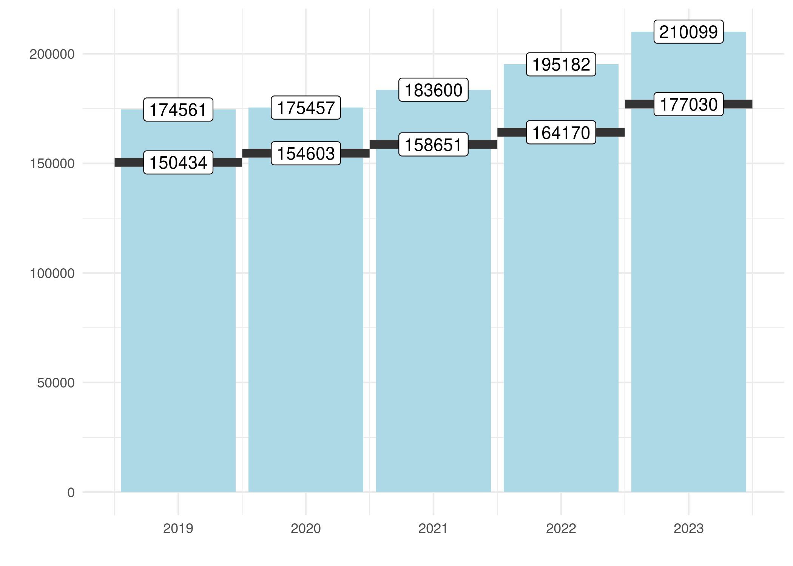
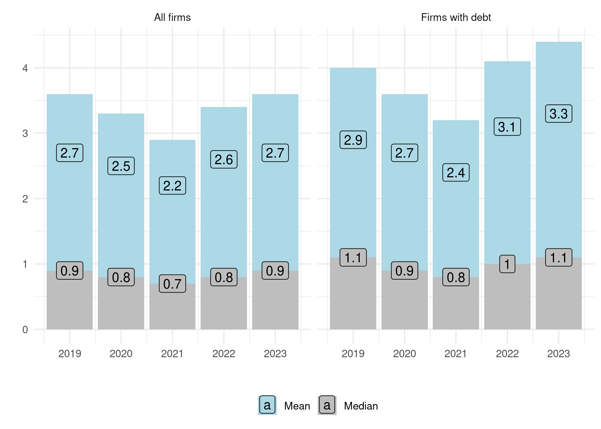
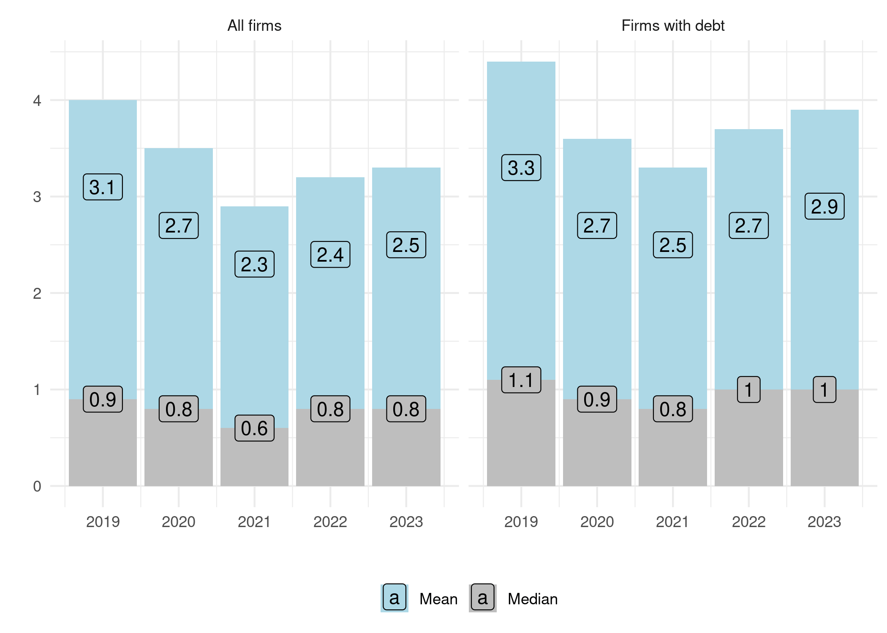

RFSD Use Case: Interest to Cost of Goods Ratio Among Russian Firms
================
Dmitriy Skougarevskiy

Is Russia a cost channel economy? In other words, do movements in
nominal interest rates affect firms’ marginal costs and production
decisions ([Bernanke and Gertler,
1989](https://www.jstor.org/stable/1804770); [Ravenna and Walsh,
2006](https://doi.org/10.1016/j.jmoneco.2005.01.004))? An increase in
the nominal interest rate may result in an increase in rates of
corporate loans provided inside or outside the realm of public
securities or banks. The net cost of borrowing rises, access to credit
deteriorates, and firms find it harder to service the debt overhang.
Struggling firms might either default or pass on the cost of servicing
their debt to consumers, leading to higher prices

Bank of Russia staff addressed this question of policy significance
using firm-level data from Interfax’s SPARK, Russia’s leading business
information provider ([Mogilyat, Moskaleva, Popova, Tyrdyeva, Tsoi
(2024)](https://www.cbr.ru/content/document/file/169979/analytic_note_20241114_ddkp.pdf),
hereafter MMPTT). The authors gathered annual financial statements for
the universe of Russian firms from Interfax’s SPARK in 2019-2023 and
computed the mean and median ratio of interest payments to cost of sales
among the firms satisfying their inclusion criteria. They found the
median ratio of about 1%, suggesting that half of non-financial firms do
not bear any sizeable debt burden.

Below we will reproduce this result with the aid of the openly available
Russian Financial Statements Database.

# Set up

``` r
library(data.table)
library(arrow)
```

    ## 
    ## Attaching package: 'arrow'

    ## The following object is masked from 'package:utils':
    ## 
    ##     timestamp

``` r
library(ggplot2)
library(ggthemes)
library(knitr)

knitr::opts_chunk$set(dpi=300,fig.width=7)
```

# Data ingestion

Note that here we import only a handful of variables necessary for this
project and the years of interest:

``` r
RFSD <- open_dataset("local/path/to/RFSD")
scan_builder <- RFSD$NewScan()
scan_builder$Filter(Expression$field_ref("year") >= 2019 & Expression$field_ref("year") <= 2023)
```

    ## ScannerBuilder

``` r
scan_builder$Project(cols = c("inn", "ogrn", "year", "okved_section", "filed", "imputed", "line_1600", "line_1700", "line_2110", "line_2120", "line_2200", "line_2300", "line_2400", "line_2330", "line_1410", "line_1510", "line_4123", "line_4224"))
```

    ## ScannerBuilder

``` r
scanner <- scan_builder$Finish()
financials <- as.data.table(scanner$ToTable())
```

    ## Warning: Potentially unsafe or invalid elements have been discarded from R metadata.
    ## ℹ Type: "externalptr"
    ## → If you trust the source, you can set `options(arrow.unsafe_metadata = TRUE)` to preserve them.

``` r
gc()
```

    ##             used   (Mb) gc trigger   (Mb) limit (Mb)  max used   (Mb)
    ## Ncells  11428071  610.4   21263614 1135.6         NA  11435179  610.8
    ## Vcells 330095436 2518.5  662205981 5052.3      65536 655706610 5002.7

``` r
# Rename variables
setnames(financials, c("line_1600", "line_1700", "line_2110", "line_2120", "line_2200", "line_2300", "line_2400", "line_2330", "line_1410", "line_1510", "line_4123", "line_4224"),
                     c("assets", "liabilities_equity", "revenue", "costofgoodssold", "salesprofit", "grossprofit", "netprofit", "interestpayable", "longtermdebts", "shorttermdebts", "currentinterestpayments", "investmentinterestpayments"),
        skip_absent = T)
```

# Filtering

Next, we engage in filtering, trying to mimic MMPTT filtering logic as
close as possible.

``` r
# Only non-financial firms
financials <- financials[okved_section != "K"]
uniqueN(financials$inn) # 4967290
```

    ## [1] 4967290

``` r
## Only firms filing statements or where we could reconstruct
## it from previous year data
cbr_sample <- financials[filed == 1 | imputed == 1]
uniqueN(cbr_sample$inn) # 3181027
```

    ## [1] 3181027

``` r
## Remove firms where at least one of variables is missing
cbr_sample <- cbr_sample[!is.na(revenue) & !is.na(costofgoodssold) & !is.na(salesprofit) & !is.na(grossprofit) ]
uniqueN(cbr_sample$inn) # 2349491
```

    ## [1] 2349491

``` r
## Remove firms with zero revenue or cost of goods sold
cbr_sample <- cbr_sample[revenue != 0 & costofgoodssold != 0]
uniqueN(cbr_sample$inn) # 2175584
```

    ## [1] 2175584

``` r
## Remove firms where assets do not match liablities and equity
cbr_sample <- cbr_sample[ assets == liabilities_equity ]
uniqueN(cbr_sample$inn) # 2161523
```

    ## [1] 2161523

``` r
## Remove firms without interest payments
cbr_sample <- cbr_sample[interestpayable != 0 & !is.na(interestpayable)]
uniqueN(cbr_sample$inn) # 371056
```

    ## [1] 371056

``` r
## Remove outlier firms in terms of interestpayable to costofgoodssold ratio
cbr_sample[, interest_cost_ratio := interestpayable/costofgoodssold]
trim_cutoffs <- quantile(cbr_sample$interest_cost_ratio, c(0.015, 0.985))
cbr_sample <- cbr_sample[ interest_cost_ratio >= trim_cutoffs[1] & interest_cost_ratio <= trim_cutoffs[2]]
uniqueN(cbr_sample$inn) # 363613
```

    ## [1] 363613

We also create a variable indicating companies with any debt:

``` r
cbr_sample[, has_debt := 0]
cbr_sample[ longtermdebts != 0 | shorttermdebts != 0, has_debt := 1]
```

# Replication

Now we have all that is necessary to replicate Figure 2 and Figure 3 of
MMPTT. Let us start with the left panel of Figure 2 that reports the
yearly count of firms, and firms with debt in the data:

``` r
# Firms by year
firms_by_year <- cbr_sample[, list(allfirms = .N, firms_with_debt = sum(has_debt)), by = c("year")][order(year)]

figure2 <- ggplot(aes(x = year), data = firms_by_year) +
                geom_col(aes(y = allfirms), fill = "lightblue") +
                geom_tile(aes(y = firms_with_debt), color = "gray") +
                geom_label(aes(y = allfirms, label = allfirms)) +
                geom_label(aes(y = firms_with_debt, label = firms_with_debt)) +
                labs(x = "", y = "") +
                theme_minimal()

plot(figure2)
```

<!-- -->


Despite our efforts to replicate the target study filtering procedures,
the RFSD has slightly more firms than SPARK in each year. This may be
due to data completeness issues with SPARK, differences in the outlier
filtering procedure of MMPTT, or differences in the definition of
financial firms between SPARK and the RFSD.

Next, we turn to a replication of Figure 3, which shows the mean and
median ratios of interest payments to cost of sales over the years for
all firms and for firms with debt:

``` r
# Mean and median interest cost ratios
## All firms
interest_cost_ratio_by_year_all_firms <- cbr_sample[, list(meanratio = mean(interest_cost_ratio), medianratio = median(interest_cost_ratio)), by = c("year")]
interest_cost_ratio_by_year_all_firms[, sample := "All firms"]

## Firms with debt
interest_cost_ratio_by_year_firms_with_debt <- cbr_sample[has_debt == 1, list(meanratio = mean(interest_cost_ratio), medianratio = median(interest_cost_ratio)), by = c("year")]
interest_cost_ratio_by_year_firms_with_debt[, sample := "Firms with debt"]

interest_cost_ratio_by_year <- rbind(interest_cost_ratio_by_year_all_firms, interest_cost_ratio_by_year_firms_with_debt, fill = T)
interest_cost_ratio_by_year <- melt(interest_cost_ratio_by_year, id.vars = c("year", "sample"), variable.name = "statistic")

# Round and to percentages
interest_cost_ratio_by_year[, value := round(100*value, 1)]

figure3 <- ggplot(aes(x = year, y = value, group = statistic, fill = statistic, label = value), data = interest_cost_ratio_by_year) +
                geom_col(aes(y = value), data = interest_cost_ratio_by_year) +
                facet_wrap(.~sample, ncol = 2) +
                geom_label() +
                scale_fill_manual(labels = c("Mean", "Median"), values = c("lightblue", "gray")) +
                labs(x = "", y = "", fill = "") +
                theme_minimal() + theme(legend.position = "bottom")

plot(figure3)
```

<!-- -->


While the medians are identical, the means tell a different story in the
RFSD data, being almost twice as large as in the MMPTT calculations. We
have no explanation for this discrepancy other than material differences
in the outlier filtering procedures between the target study and our
replication which we cannot account for here as they are undocumented.
These differences do matter, as they double the interest expense to cost
of sales ratio, which was found to be insignificant in the original
study.

We conclude our replication by suggesting an alternative source of data
for the ratio. Larger companies report their current and investment
interest payments in their cash flow statements. We will use this
information to test whether the resulting ratios are close to the
originally defined ones.

``` r
cbr_sample[, interestpayments := currentinterestpayments ]
cbr_sample[!is.na(investmentinterestpayments) & !is.na(currentinterestpayments), interestpayments := currentinterestpayments + investmentinterestpayments]

cbr_sample[, interestpayments_cost_ratio := interestpayments/costofgoodssold ]

# Mean and median interest payment to cost ratios
## All firms
interestpayments_cost_ratio_by_year_all_firms <- cbr_sample[!is.na(interestpayments_cost_ratio), list(meanratio = mean(interestpayments_cost_ratio), medianratio = median(interestpayments_cost_ratio)), by = c("year")]
interestpayments_cost_ratio_by_year_all_firms[, sample := "All firms"]

## Firms with debt
interestpayments_cost_ratio_by_year_firms_with_debt <- cbr_sample[has_debt == 1 & !is.na(interestpayments_cost_ratio), list(meanratio = mean(interestpayments_cost_ratio), medianratio = median(interestpayments_cost_ratio)), by = c("year")]
interestpayments_cost_ratio_by_year_firms_with_debt[, sample := "Firms with debt"]

interestpayments_cost_ratio_by_year <- rbind(interestpayments_cost_ratio_by_year_all_firms, interestpayments_cost_ratio_by_year_firms_with_debt, fill = T)
interestpayments_cost_ratio_by_year <- melt(interestpayments_cost_ratio_by_year, id.vars = c("year", "sample"), variable.name = "statistic")

# Round and to 100
interestpayments_cost_ratio_by_year[, value := round(100*value, 1)]

figure3_alt <- ggplot(aes(x = year, y = value, group = statistic, fill = statistic, label = value), data = interestpayments_cost_ratio_by_year) +
                geom_col(aes(y = value), data = interestpayments_cost_ratio_by_year) +
                facet_wrap(.~sample, ncol = 2) +
                geom_label() +
                scale_fill_manual(labels = c("Mean", "Median"), values = c("lightblue", "gray")) +
                labs(x = "", y = "", fill = "") +
                theme_minimal() + theme(legend.position = "bottom")
plot(figure3_alt)
```

<!-- -->

Here we observe an even higher interest/cost ratio, possibly indicating
a greater role for the cost channel in the Russian economy.
