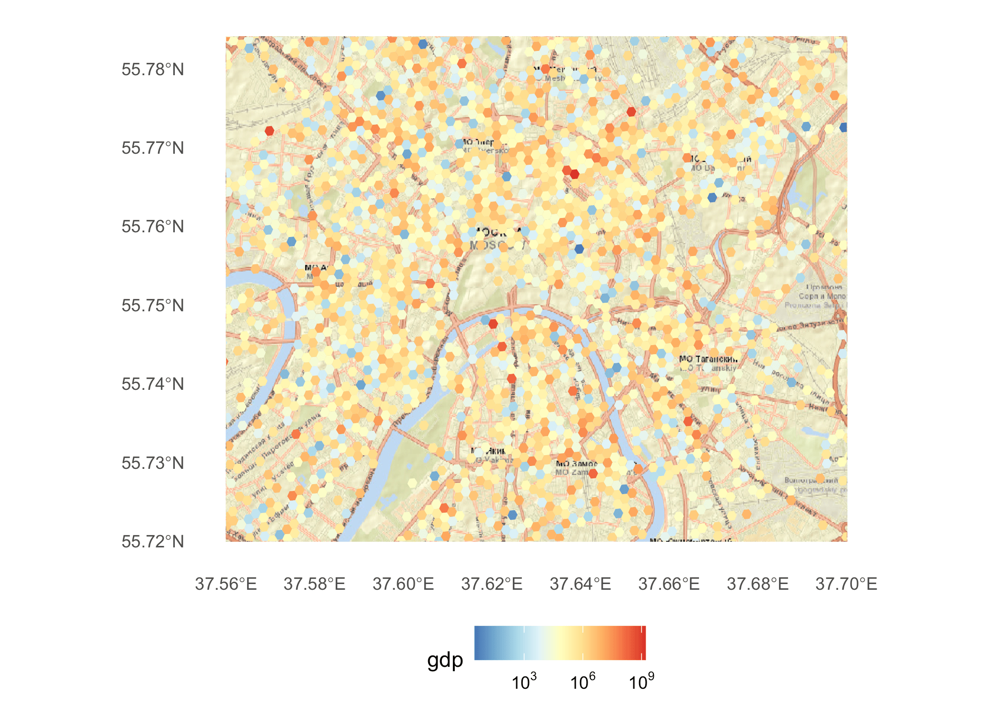
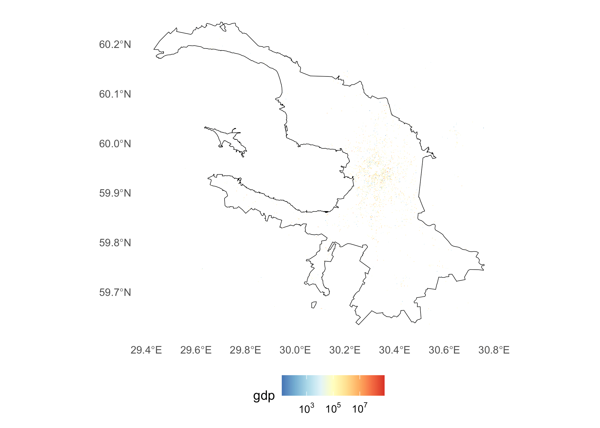
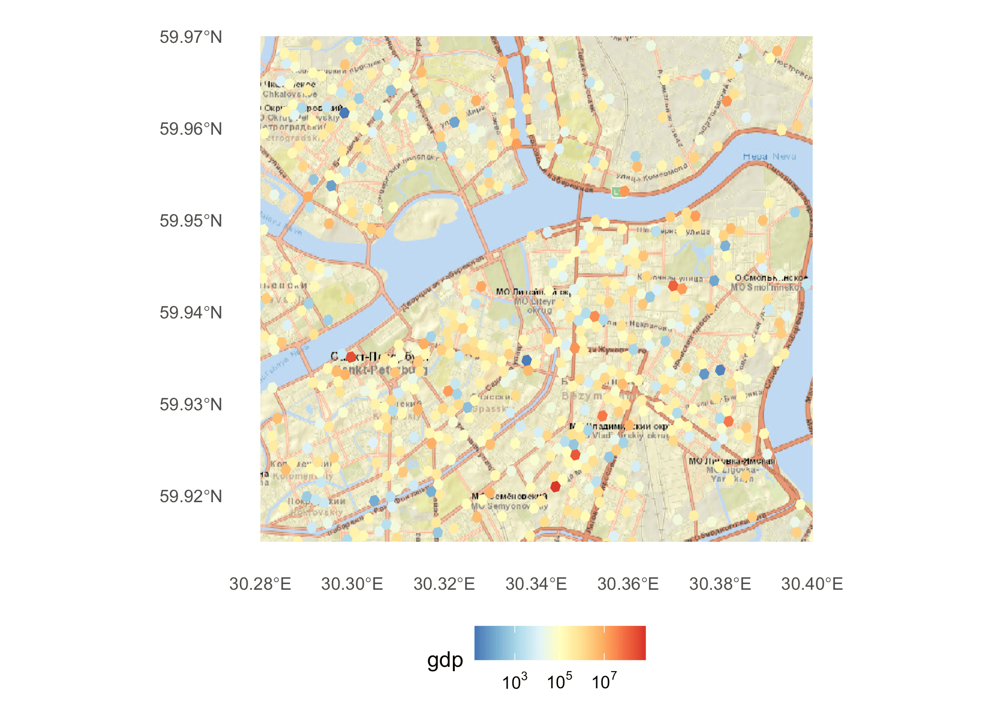
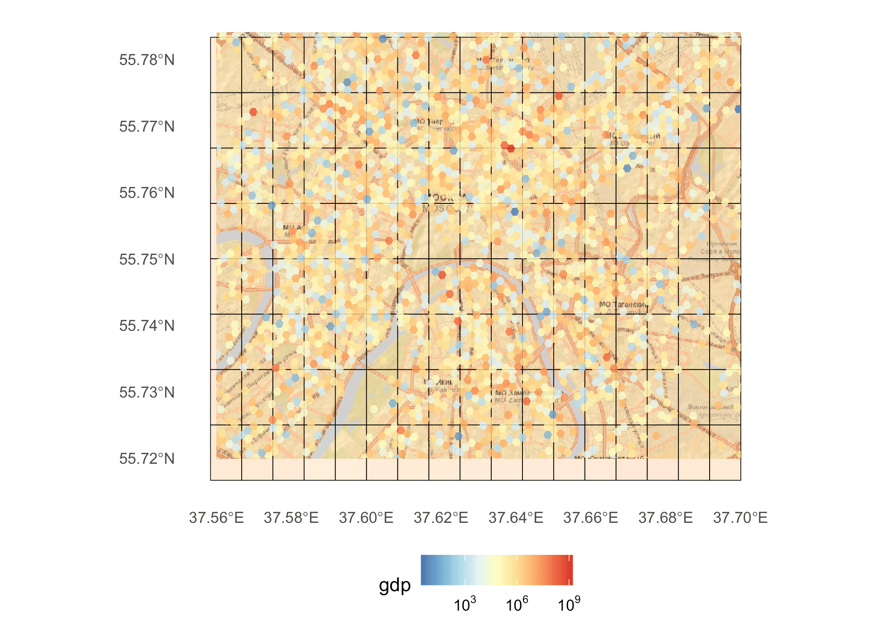

RFSD Use Case: GDP Spatialization
================
Dmitriy Skougarevskiy

Traditional Gross Domestic Product (GDP) data is confined to
region-level subnational units at best, provided as the Gross Regional
Product. This data hinders any within-region analysis of economic
development, industrial distribution, or urbanisation. The solution has
been the development of a series of techniques to infer the spatial
distribution of GDP at the level of a fine grid using nighttime lights
or land use data \[[1](https://doi.org/10.1016/j.rse.2013.03.001),
[2](https://doi.org/10.1038/s41597-022-01540-x),
[3](https://doi.org/10.3390/rs13142741),
[4](https://doi.org/10.1257/aer.102.2.994),
[5](https://doi.org/10.1177/0022343316630359)\]. Spatial inference is
conducted with sophisticated machine learning models trained on light
intensity and land use data offered via remote sensing of the Earth. The
idea is to downscale national or subnational Gross Domestic Product data
to pixel (grid) level depending on night time lights emanating from the
pixels and the type of land (forest land, cropland, grassland, wetlands,
settlements, etc.).

Although well accepted in the literature (see
\[[6](https://doi.org/10.1038/sdata.2018.4),
[7](https://doi.org/10.1038/s41597-022-01322-5)\] as the most widely
used data sources), these GDP spatializations may suffer from
measurement errors in night lights (e.g. upward bias introduced by gas
flaring, data omissions due to cloud cover, auroras in high latitudes),
misclassified land use types, and can only be trusted only if inference
is conducted in a responsible way (no data leakage, spatial
cross-validation of predictions, appropriate loss function, handling of
gaps or outliers).

Here we offer an alternative GDP spatialization for Russia that does not
require a sophisticated machine learning model or remote sensing data.
We benefit from the fact that the openly available Russian Financial
Statements Database geocodes most of the firms by their address of
incorporation. The geocoding is done at a very fine level: throughout
2014-2023 88.8% of total revenue is geocoded up to a house or street on
average in the RFSD. In this way, we are able to simply aggregate the
value added of firms in an area of interest to obtain the spatialization
of GDP.

# Set up

``` r
library(data.table)
library(arrow)
```

    ## 
    ## Attaching package: 'arrow'

    ## The following object is masked from 'package:utils':
    ## 
    ##     timestamp

``` r
library(knitr)
library(stringi)
library(stringr)
library(sf)
```

    ## Linking to GEOS 3.12.2, GDAL 3.9.2, PROJ 9.4.1; sf_use_s2() is TRUE

``` r
library(terra)
```

    ## terra 1.7.78

    ## 
    ## Attaching package: 'terra'

    ## The following object is masked from 'package:knitr':
    ## 
    ##     spin

    ## The following object is masked from 'package:arrow':
    ## 
    ##     buffer

    ## The following object is masked from 'package:data.table':
    ## 
    ##     shift

``` r
library(ggplot2)
library(scales)
```

    ## 
    ## Attaching package: 'scales'

    ## The following object is masked from 'package:terra':
    ## 
    ##     rescale

``` r
library(tidyterra)
```

    ## 
    ## Attaching package: 'tidyterra'

    ## The following object is masked from 'package:stats':
    ## 
    ##     filter

``` r
library(ggthemes)
library(RColorBrewer)
library(rgeoboundaries)
library(rmapshaper)
library(egg)
```

    ## Loading required package: gridExtra

``` r
library(h3jsr)
library(maptiles)

knitr::opts_chunk$set(dpi=300,fig.width=7)
```

# Data ingestion

Note that here we import only a handful of variables necessary and one
year of interest — 2015. We chose this year to allow comparisons with
alternative GDP spatializations, in particular, Kummu et
al. \[[6](https://doi.org/10.1038/sdata.2018.4)\], which are only
available at a fine level of detail for this year.

``` r
RFSD <- open_dataset("local/path/to/RFSD")
scan_builder <- RFSD$NewScan()
scan_builder$Filter(Expression$field_ref("year") = 2015)
scan_builder$Project(cols = c("inn", "ogrn", "region", "year", "eligible", "filed", "imputed", "financial", "outlier", "line_2110", "line_4121", "geocoding_quality", "lon", "lat"))
scanner <- scan_builder$Finish()
financials <- as.data.table(scanner$ToTable())
gc()
```

# Filtering

Next, we engage in filtering, keeping only non-financial firms (i.e. no
banks, insurers, or brokers) filing non-anomalous statements. Since GDP
is the sum of value added across industries, we also calculate the value
added of each firm, defined simply as revenue minus materials.

``` r
# Only eligible non-financial firms with non-anomalous filings
financials <- financials[eligible == 1 & (filed == 1 | imputed == 1) & financial == 0 & outlier == 0]

# Generate value added
financials[, va := NA_real_]
financials[revenue > 0 & materials > 0 & (revenue - materials) > 0, va := revenue - materials ]

# Remove firms with negative value added
financials <- financials[va >  0]
uniqueN(financials$inn) # 136429 firms
```

    ## [1] 136429

``` r
# Remove firms with low geocoding quality
financials <- financials[geocoding_quality %in% c("house", "street")]
uniqueN(financials$inn) # 122616 firms
```

    ## [1] 122616

# Aggregation

Now that we have the information on spatialized value added for over 120
thousand Russian firms in 2015, we need to aggregate it on a certain
grid. We use [Uber H3](https://github.com/uber/h3), a hierarchical
geospatial indexing system designed to partition the world into
hexagonal cells, allowing for efficient spatial queries. We will use
[`h3jsr`](https://cran.r-project.org/web/packages/h3jsr/vignettes/intro-to-h3jsr.html)
library to translate spatial data into the H3 system.

As H3 is a hierarchical index, it is available at different resolutions,
from planetary to house level. We will aggregate at resolution level 10,
with 15,047 m² per hexagon
\[[8](https://h3geo.org/docs/core-library/restable/#average-area-in-m2)\].
However, aggregation can be done at any resolution.

``` r
# Map to H3 address space at given resolution
financials[, h3_address := point_to_cell(financials[, c("lon", "lat")], res = 10)]
```

    ## Assuming columns 1 and 2 contain x, y coordinates in EPSG:4326

``` r
# Total value added per H3 address
financials_agg <- financials[, list(gdp = sum(va)), by = c("h3_address")]

# Aggregated spatialized value added to sf object with POLYGON geometry
# drawing hexes
financials_agg_sf <- cell_to_polygon(financials_agg, simple = F)
```

# Visualisation

Let us now showcase the results of the aggregation for selected regions.
We will use geoBoundaries
\[[8](https://doi.org/10.1371/journal.pone.0231866)\] as the source of
information on subnational division in Russia to zoom to selected
regions.

``` r
# Russian boundaries
russia_regions <- geoboundaries("Russia", release_type = "gbOpen", adm_lvl = "adm1")
russia_regions <- st_make_valid(russia_regions)
# Simplification is required to fix errors in geometries
russia_regions <- ms_simplify(russia_regions, keep = 0.5)
russia_regions <- st_wrap_dateline(russia_regions)
```

Here is Moscow:

``` r
boundaries <- russia_regions[russia_regions$shapeName == "Moscow",]
extent <- st_bbox(boundaries)
financials_zoom <- st_crop(financials_agg_sf, extent)
```

    ## Warning: attribute variables are assumed to be spatially constant throughout
    ## all geometries

``` r
viz <- ggplot(aes(fill = gdp), data = financials_zoom) +
    geom_sf(data = boundaries, fill = NA, color = "black") + 
    geom_sf(color = NA) +
    scale_fill_whitebox_c(palette = "bl_yl_rd", direction = 1, labels = math_format(format = log10), transform = "log10") +
    coord_sf(default_crs = sf::st_crs(4326)) +
    theme_minimal() +
    theme(legend.position = "bottom", panel.grid.minor = element_blank(), panel.grid.major = element_blank())
plot(viz)
```

<!-- -->

Zoom in to Moscow inside the Garden Ring, adding ESRI World Street Map
tiles as visual reference:

``` r
extent <- st_bbox(c(xmin = 37.56, xmax = 37.7, ymin = 55.72, ymax = 55.784))
financials_zoom <- st_crop(financials_agg_sf, extent)
```

    ## Warning: attribute variables are assumed to be spatially constant throughout
    ## all geometries

``` r
tiles <- get_tiles(financials_zoom, provider = "Esri.WorldStreetMap", zoom = 13, crop = T)

viz <- ggplot(aes(fill = gdp), data = financials_zoom) +
    geom_spatraster_rgb(data = tiles) +
    geom_sf(color = NA) +
    scale_fill_whitebox_c(palette = "bl_yl_rd", direction = 1, labels = math_format(format = log10), transform = "log10") +
    coord_sf(default_crs = sf::st_crs(4326)) +
    theme_minimal() +
    theme(legend.position = "bottom", panel.grid.minor = element_blank(), panel.grid.major = element_blank())
plot(viz)
```

<!-- -->

Note that we do not report hexes with no value added. The benefit of
this becomes evident when we look at Saint Petersburg:

``` r
boundaries <- russia_regions[russia_regions$shapeName == "Saint Petersburg",]
extent <- st_bbox(boundaries)
financials_zoom <- st_crop(financials_agg_sf, extent)
```

    ## Warning: attribute variables are assumed to be spatially constant throughout
    ## all geometries

``` r
viz <- ggplot(aes(fill = gdp), data = financials_zoom) +
    geom_sf(data = boundaries, fill = NA, color = "black") + 
    geom_sf(color = NA) +
    scale_fill_whitebox_c(palette = "bl_yl_rd", direction = 1, labels = math_format(format = log10), transform = "log10") +
    coord_sf(default_crs = sf::st_crs(4326)) +
    theme_minimal() +
    theme(legend.position = "bottom", panel.grid.minor = element_blank(), panel.grid.major = element_blank())
plot(viz)
```

<!-- -->

The RFSD spatialization closely matches the settled areas of the city.
Now zoom in to the Historic Centre of Saint Petersburg:

``` r
extent <- st_bbox(c(xmin = 30.28, xmax = 30.4, ymin = 59.915, ymax = 59.97))
financials_zoom <- st_crop(financials_agg_sf, extent)
```

    ## Warning: attribute variables are assumed to be spatially constant throughout
    ## all geometries

``` r
tiles <- get_tiles(financials_zoom, provider = "Esri.WorldStreetMap", zoom = 13, crop = T)

viz <- ggplot(aes(fill = gdp), data = financials_zoom) +
    geom_spatraster_rgb(data = tiles) +
    geom_sf(color = NA) +
    scale_fill_whitebox_c(palette = "bl_yl_rd", direction = 1, labels = math_format(format = log10), transform = "log10") +
    coord_sf(default_crs = sf::st_crs(4326)) +
    theme_minimal() +
    theme(legend.position = "bottom", panel.grid.minor = element_blank(), panel.grid.major = element_blank())
plot(viz)
```

<!-- -->

# Comparison With Existing Spatializations

Existing GDP spatializations are available at a resolution of 30
arcseconds (~1 km × 1 km at equator) at best
\[[6](https://doi.org/10.1038/sdata.2018.4),
[7](https://doi.org/10.1038/s41597-022-01322-5)\]. Here we will visually
assess the benefit of the fine grid provided by the RFSD by juxtaposing
Kummu et al. \[[6](https://doi.org/10.1038/sdata.2018.4)\]
spatialization with our spatialization. We will obtain the raster data
from Kummu et al. for 2015 from
[Dryad](https://doi.org/10.5061/dryad.dk1j0) (February 13, 2020 version),
cut it to Russia’s extent, and convert to 2015 Rubles, as the RFSD data.

``` r
# All-Russia boundary
# (do not use st_union as it fails to handle antimeridian cutting)
russia_boundary <- ms_dissolve(russia_regions)
russia_boundary <- st_wrap_dateline(russia_boundary)

# Load Kummu et al. 2018 (https://doi.org/10.1038/sdata.2018.4)
# 30 arc-sec (1km at equator) global gridded raster for 2015.
# Units are constant 2011 international USD
# Projection is WGS84
kummu_2015_1km <- rast("local/path/to/kummu_et_al_2018/GDP_PPP_30arcsec_v3.nc", lyrs = 3)

# Cut to Russia's extent
kummu_2015_1km <- crop(kummu_2015_1km, ext(vect(russia_boundary)))

# To the same units
## 2011 Geary–Khamis dollars to billions of 2015 US dollars
## https://www.imf.org/external/datamapper/PPPEX@WEO/OEMDC/ADVEC/WEOWORLD/DA/IND
## OR https://prosperitydata360.worldbank.org/en/indicator/IMF+WEO+PPPEX
international_dollar_rub_2011_exchange_rate <- 18.41

### From 2011 international dollar to 2011 RUB
kummu_2015_1km <- kummu_2015_1km*international_dollar_rub_2011_exchange_rate

### From 2011 RUB to 2015 RUB accounting for inflation
## https://www.statbureau.org/en/russia/inflation-calculators?dateBack=2011-1-1&dateTo=2015-12-1&amount=1000
rub_2011_2015_price_change <- 1.5135
kummu_2015_1km <- kummu_2015_1km*rub_2011_2015_price_change

### To thousands of rubles, as the RFSD
kummu_2015_1km <- kummu_2015_1km/1000
```

We are ready to juxtapose the two spatializations for Moscow’s Garden
Ring:

``` r
extent <- c(xmin = 37.56, xmax = 37.7, ymin = 55.72, ymax = 55.784)

financials_zoom <- st_crop(financials_agg_sf, st_bbox(extent))
```

    ## Warning: attribute variables are assumed to be spatially constant throughout
    ## all geometries

``` r
kummu_2015_1km_zoom <- crop(x = kummu_2015_1km, y = ext(extent, xy = F))
tiles <- get_tiles(financials_zoom, provider = "Esri.WorldStreetMap", zoom = 13, crop = T)

# Convert raster to polygons for visualization
kummu_2015_1km_zoom_polygons <- as.polygons(kummu_2015_1km_zoom, aggregate = F)

viz <- ggplot(aes(fill = gdp), data = financials_zoom) +
  geom_spatraster_rgb(data = tiles) +
  #geom_spatraster(data = kummu_2015_1km_zoom, alpha = 0.9, aes(color = "black")) +
  geom_spatvector(data = kummu_2015_1km_zoom_polygons, alpha = 0.3, aes(fill = GDP_PPP_3), color = "black") +
    geom_sf(color = NA, alpha = 0.8) +
    scale_fill_whitebox_c(palette = "bl_yl_rd", direction = 1, labels = math_format(format = log10), transform = "log10") +
    coord_sf(default_crs = sf::st_crs(4326)) +
    theme_minimal() +
    theme(legend.position = "bottom", panel.grid.minor = element_blank(), panel.grid.major = element_blank())
plot(viz)
```

<!-- -->

A 1 km grid from the Kummu et al. spatialisation contains about 28
hexagons from the RFSD spatialisation at resolution 10. This means that
the H3 spatial indexing system at resolution 10 provides about 28 times
more data than the Kummu et al. spatialisation. We can bring even more
data to the table by increasing the H3 resolution for street-level or
even house-level analysis.

However, our spatialization had an important drawback due to a
fundamental difference. The unconsolidated financial statements are
reported according to the Russian accounting rules on book value while
the National Accounts are compiled based on the System of National
Accounts rules and are valued at market prices. Gross Domestic Product
also accounts for shadow economy and non-market production that is
completely missing in the RFSD. Our GDP spatialization coming from
financial statements is therefore downward biased due to price
differences and non-market output.
