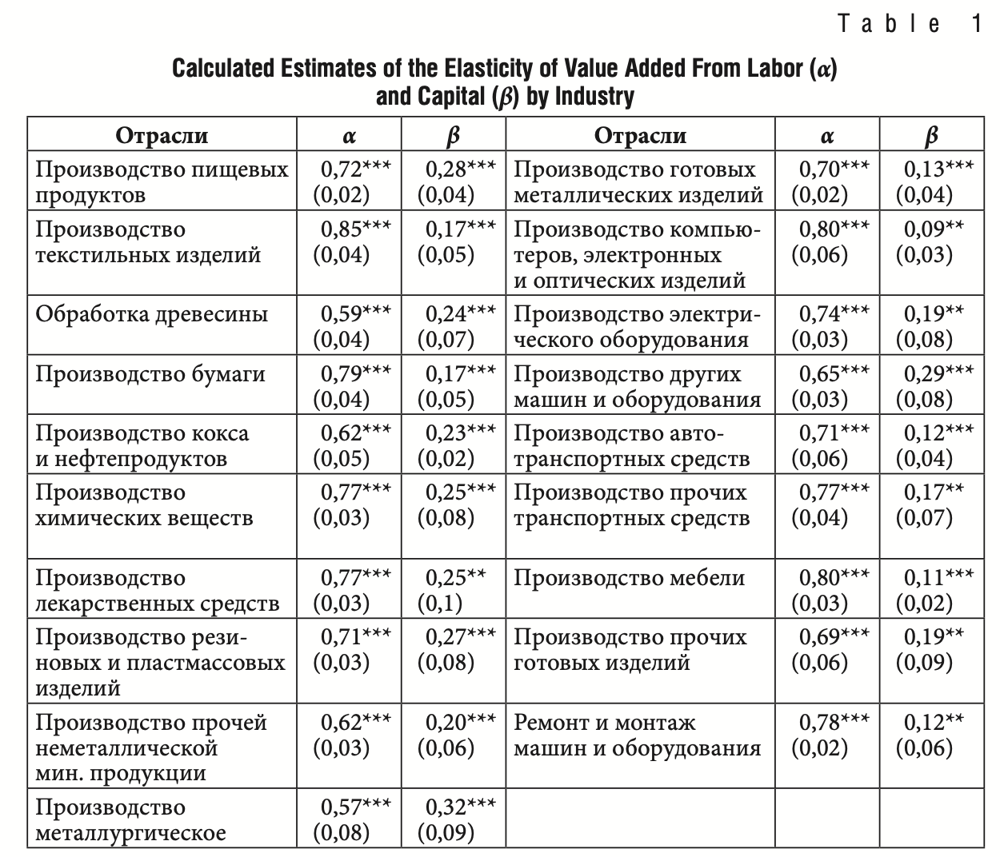

RFSD Use Case: Total Factor Productivity Estimation
================
Dmitriy Skougarevskiy

Production function estimation is one of the central problems in
empirical industrial organization [Einav and Levin
(2010)](https://pubs.aeaweb.org/doi/pdfplus/10.1257/jep.24.2.145).
Correct estimation requires detailed plant×product-level data on factor
prices and utilization, output, and intermediate consumption, knowledge
of industry deflators, and a host of identifying assumptions to combat
endogeneity in the estimated factor elasticities. In this tutorial we
assume away most of the estimation challenges and offer a simplified
replication of one of the numerous studies estimating production
function of Russian firms — [Kaukin and Zhemkova
(2023)](https://doi.org/10.18288/1994-5124-2023-5-68-99), KZ henceforth.

KZ rely on Moody’s Bureau van Dijk’s Ruslana, a country subset of Orbis,
to draw information on firm-level value added, labour, and capital for
2012-2018. They then apply a standard [Olley and Pakes
(1996)](https://doi.org/10.2307/2171831) production function estimator.
Here we will reproduce this result with the aid of the openly available
Russian Financial Statements Database.

# Set up

``` r
library(data.table)
library(arrow)
```

    ## 
    ## Attaching package: 'arrow'

    ## The following object is masked from 'package:utils':
    ## 
    ##     timestamp

``` r
library(knitr)
library(openxlsx)
library(prodest)
```

    ## Loading required package: dplyr

    ## 
    ## Attaching package: 'dplyr'

    ## The following objects are masked from 'package:data.table':
    ## 
    ##     between, first, last

    ## The following objects are masked from 'package:stats':
    ## 
    ##     filter, lag

    ## The following objects are masked from 'package:base':
    ## 
    ##     intersect, setdiff, setequal, union

    ## Loading required package: parallel

    ## Loading required package: Matrix

# Data ingestion

Note that here we import only a handful of variables necessary for this
project and the years of interest:

``` r
RFSD <- open_dataset("local/path/to/RFSD")
scan_builder <- RFSD$NewScan()
scan_builder$Filter(Expression$field_ref("year") >= 2011 & Expression$field_ref("year") <= 2018)
scan_builder$Project(cols = c("inn", "ogrn", "year", "okved_section", "okved", "eligible", "filed", "imputed", "outlier", "line_1150", "line_2110", "line_4121", "line_4122"))
scanner <- scan_builder$Finish()
financials <- as.data.table(scanner$ToTable())
gc()

# Rename variables
setnames(financials, c("line_1150", "line_2110", "line_4121", "line_4122"),
					 c("capital", "revenue", "materials", "labour"),
		skip_absent = T)
```

# Filtering

Next, we engage in filtering, trying to mimic KZ filtering logic as
close as possible.

``` r
## Only eligible firms filing statements or where we could reconstruct
## it from previous year data
financials <- financials[eligible == 1 & (filed == 1 | imputed == 1)]
uniqueN(financials$inn) # 3976302
```

    ## [1] 3976302

``` r
## Only firms in manufacturing
financials <- financials[okved_section == "C"]
uniqueN(financials$inn) # 336995
```

    ## [1] 336995

# Deflation

KZ use industry- and factor-specific deflators to convert their factor
and value added data to real values. Here, for the sake of brevity, we
will simply deflate all the data with GDP deflator from Russian National
Accounts.

``` r
# Deflate by GDP deflator
# (see https://rosstat.gov.ru/statistics/accounts)
gdp_deflator_1 <- as.data.table(read.xlsx("https://rosstat.gov.ru/storage/mediabank/VVP_god_s_1995-2023.xlsx", sheet = 10))
gdp_deflator_1 <- as.numeric(gdp_deflator_1[c(3)])
gdp_deflator_1 <- data.table(year = 1996:2011, deflator = gdp_deflator_1)
gdp_deflator_2 <- as.data.table(read.xlsx("https://rosstat.gov.ru/storage/mediabank/VVP_god_s_1995-2023.xlsx", sheet = 11))
gdp_deflator_2 <- as.numeric(gdp_deflator_2[c(3)])
gdp_deflator_2 <- data.table(year = 2012:2023, deflator = gdp_deflator_2)

gdp_deflator <- rbind(gdp_deflator_1, gdp_deflator_2)

# To 2018 rubles
gdp_deflator[, gdp_deflator_base := NA_real_]
gdp_deflator[year == 2018, gdp_deflator_base := 100]

# Carry backward
for(y in (2018-1):min(gdp_deflator$year)) {
    gdp_deflator[year == y, gdp_deflator_base := gdp_deflator[year == (y + 1)]$gdp_deflator_base/(gdp_deflator[year == (y + 1)]$deflator/100)]
}
# Carry forward
for(y in (2018+1):max(gdp_deflator$year)) {
    gdp_deflator[year == y, gdp_deflator_base := gdp_deflator[year == (y - 1)]$gdp_deflator_base*(gdp_deflator[year == y]$deflator/100)]
}

gdp_deflator[, deflator2018rub := (gdp_deflator_base / 100)]
gdp_deflator <- gdp_deflator[, c("year", "deflator2018rub")]
financials <- merge(financials, gdp_deflator, by = "year")

vars_to_deflate <- c("capital", "revenue", "materials", "labour")
financials[, c(vars_to_deflate) := lapply(.SD, function(x) round(x / deflator2018rub)), .SDcols = vars_to_deflate]
```

# Investment

Olley-Pakes estimator requires proxy variables to control for
unobservables. KZ use investment as internal proxy variable constructed
as difference in capital across years net of depreciation.

``` r
## Create investment variable
setorderv(financials, c("inn", "year"))
financials[, capital_l1 := shift(capital, 1, type = "lag")]
financials[, inn_l1 := shift(inn, 1, type = "lag")]
financials[, year_l1 := shift(year, 1, type = "lag")]

# Investment is current capital minus previous year capital excluding depreciation (4% per year)
financials[, investment := capital - capital_l1 - capital_l1*0.04 ]
financials[inn != inn_l1 | year - year_l1 > 1, investment := NA_real_]
financials[, c("inn_l1", "year_l1", "capital_l1") := NULL]

# No divestment
financials[investment <= 0, investment := 0.0001 ]
```

Finally, we engage in an additional round of filtering:

``` r
## Only 2012-2018 (we required 2011 only to construct investment for 2012)
financials <- financials[year >= 2012 & year <= 2018]

## Remove firms where at least one of variables is missing or is negative
financials <- financials[ revenue > 0 & materials > 0 & capital > 0 & labour > 0 & investment > 0]
uniqueN(financials$inn) # 31775
```

    ## [1] 31775

``` r
## Remove firms with zero or negative value added
financials[, va := revenue - materials]
financials <- financials[ va > 0]
uniqueN(financials$inn) # 28590
```

    ## [1] 28590

``` r
## Remove firms with gaps in filing
financials[, obs_per_firm := .N, by = "inn"]
financials[, obs_per_firm_expected := max(year) - min(year) + 1, by = c("inn") ]
financials <- financials[obs_per_firm_expected == obs_per_firm]
uniqueN(financials$inn) # 24259
```

    ## [1] 24259

``` r
## Only firms active for more than 1 year
financials <- financials[ obs_per_firm > 1]
uniqueN(financials$inn) # 15121
```

    ## [1] 15121

``` r
financials[, c("obs_per_firm", "obs_per_firm_expected") := NULL]

## 2-digit industry
financials[, industry := substr(okved, 1, 2)]

## Assign industry names to match KZ's Orbis industry classification
financials[industry %in% c("10", "11", "12"), industry := "01. Food, beverages, and tobacco"]
financials[industry %in% c("13", "14", "15"), industry := "02. Textiles and textile products"]
financials[industry == "16", industry := "03. Wood and products of wood and cork"]
financials[industry %in% c("17", "18"), industry := "04. Pulp, paper, printing and publishing"]
financials[industry == c("19"), industry := "05. Coke, refined petroleum"]
financials[industry == c("20"), industry := "06. Chemicals and chemical products"]
financials[industry == c("21"), industry := "07. Pharmaceutical products"]
financials[industry == c("22"), industry := "08. Rubber and plastics"]
financials[industry == c("23"), industry := "09. Other non-metallic mineral"]
financials[industry == c("24"), industry := "10. Basic metals"]
financials[industry == c("25"), industry := "11. Fabricated metals"]
financials[industry == c("26"), industry := "12. Electrical and optical equipment"]
financials[industry == c("27"), industry := "13. Electrical equipment"]
financials[industry == c("28"), industry := "14. Machinery, not elsewhere classified"]
financials[industry %in% c("29", "30"), industry := "15. Transport equipment"]
financials[industry %in% c("31"), industry := "16. Furniture"]
financials[industry %in% c("32"), industry := "17. Manufacturing, not elsewhere classified"]
financials[industry %in% c("33"), industry := "18. Equipment repairs and installation"]

# To logs
vars_to_log <- c("va", "labour", "capital", "materials", "investment")
financials[, paste0("ln_", vars_to_log) := lapply(.SD, log), .SDcols = vars_to_log]

# Firm id variable
financials[, id := .GRP, by = "inn"]
```

# Estimation

We are now ready to perform industry-level estimation of the production
function. We will use `prodest` package by [Rovigatti
(2017)](https://doi.org/10.21105/joss.00371). NB: the estimation will
take about 1-2 minutes.

``` r
# Init a list to store the coefficients
factor_elasticities_list <- list()

for(i in unique(financials$industry)) {

    financials_subset <- financials[ industry == i]

    fit <- prodestOP(Y = financials_subset$ln_va,
                fX = financials_subset$ln_labour,
                sX = financials_subset$ln_capital,
                pX = financials_subset$ln_investment,
                idvar = financials_subset$id,
                timevar = financials_subset$year,
                exit = F,
                R = 20)

    factor_elasticities_list[[i]] <- data.table(industry = i, labour = as.numeric(coef(fit)["fX1"]), capital = as.numeric(coef(fit)["sX1"]))

}

 # From list to data.table
factor_elasticities <- rbindlist(factor_elasticities_list)
factor_elasticities <- factor_elasticities[order(industry)]

# Round to two digits
factor_elasticities[, labour := round(labour, 2)]
factor_elasticities[, capital := round(capital, 2)]
```

# Results

We are now ready to compare the factor elasticities in our replication
with the original study per sector.

``` r
kable(factor_elasticities, caption = "Replication of KZ Table 1 With Factor Elasticities")
```

| industry                                     | labour | capital |
|:---------------------------------------------|-------:|--------:|
| 01\. Food, beverages, and tobacco            |   0.78 |    0.09 |
| 02\. Textiles and textile products           |   0.83 |    0.03 |
| 03\. Wood and products of wood and cork      |   0.74 |    0.05 |
| 04\. Pulp, paper, printing and publishing    |   0.82 |    0.07 |
| 05\. Coke, refined petroleum                 |   0.73 |   -0.04 |
| 06\. Chemicals and chemical products         |   0.72 |    0.02 |
| 07\. Pharmaceutical products                 |   0.82 |    0.20 |
| 08\. Rubber and plastics                     |   0.79 |    0.09 |
| 09\. Other non-metallic mineral              |   0.69 |    0.05 |
| 10\. Basic metals                            |   0.63 |    0.06 |
| 11\. Fabricated metals                       |   0.75 |    0.05 |
| 12\. Electrical and optical equipment        |   0.83 |    0.12 |
| 13\. Electrical equipment                    |   0.78 |    0.01 |
| 14\. Machinery, not elsewhere classified     |   0.74 |    0.04 |
| 15\. Transport equipment                     |   0.69 |    0.16 |
| 16\. Furniture                               |   0.84 |    0.07 |
| 17\. Manufacturing, not elsewhere classified |   0.81 |   -0.01 |
| 18\. Equipment repairs and installation      |   0.85 |    0.00 |

Replication of KZ Table 1 With Factor Elasticities



Both in the replication and in KZ, we observe that the estimated labour
elasticities that are much larger than capital elasticities. The
magnitudes, however, are markedly different, with our replication
yielding unrealistic negative elasticities for certain industries. We
provide 5 explanations for the apparent failure to replicate KZ exactly:

- **Data differences between Orbis and the RFSD**. The latter source
  includes more firms, as documented in our comparison in the [RFSD
  companion paper](http://arxiv.org/abs/2501.05841): \> Out of 185,222
  firms with financials for 2021 available in our Orbis sample, the vast
  majority of firms (182,641, 98.6%) also have their financials in the
  RFSD for 2021. The firms present in both data sets had over \$2
  trillion of total revenue or assets, forming the bulk of the Russian
  economy in 2021. The RFSD also includes 58,835 firms reporting over
  \$1 million in revenue in 2021 that are missing in Orbis.

- **Differences in sample restrictions**. We remove firms with gaps in
  data in 2012-2018. This is reasonable as it is impossible to calculate
  the investment proxy variable defined as first difference in capital
  when capital is unknown in any of adjacent years. We do not know how
  this was handled by KZ.

- **Differences in deflators**. KZ use different sectoral deflators for
  different factors, while we resorted to a simpler solution, using one
  GDP deflator. Also, we do not know the base year in KZ as it is not
  mentioned in the text (we deflate to 2018 rubles in the replication).

- **Value added definition**. Olley-Pakes is a value added-based
  production function estimator. Orbis
  [defines](https://help.bvdinfo.com/mergedProjects/68_EN/Data/Financial/GobalFormatDefs.htm)
  value added as `TAXA+PL+STAF+DEPR+INTE`, or Taxation (i.e. Current
  profit tax + Deferred tax liabilities - Deferred tax assets) + Profit
  (Loss) for Period + Cost of Employees + Depreciation + Interest
  payable. KZ write that they define value added simply as revenue minus
  materials and we follow this logic in our replication. However, we
  cannot rule our a possibility of additional steps KZ may have taken
  when constructing their value added variable which we cannot replicate
  as they may be undocumented.

- **Proxy variable**. To deal with endogeneity, KZ define investment
  (first difference in capital) as proxy variable. Since the least
  realistic estimates in our replication are for capital elasticities,
  this may be the culprit. KZ do not report how they dealt with
  divestment (negative first difference in real capital): we treated
  those variables as near-zero investment before taking logs.
